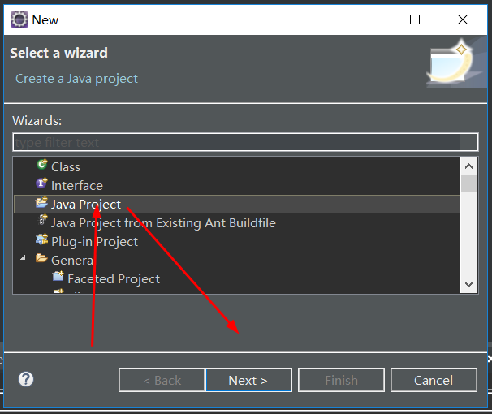
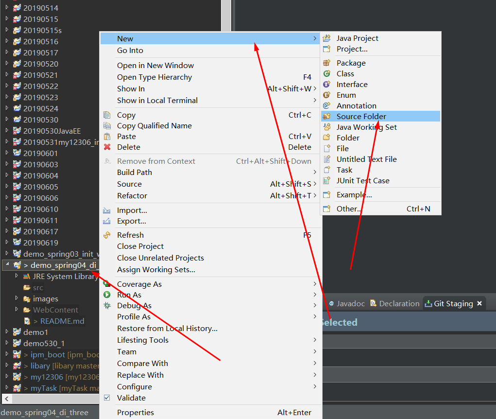
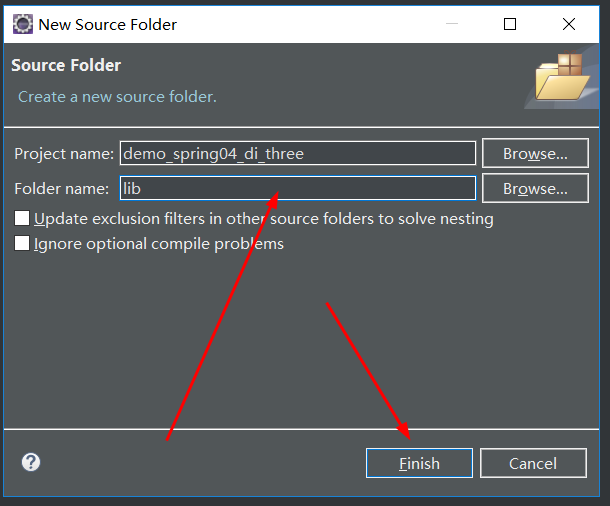
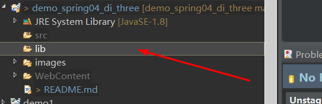
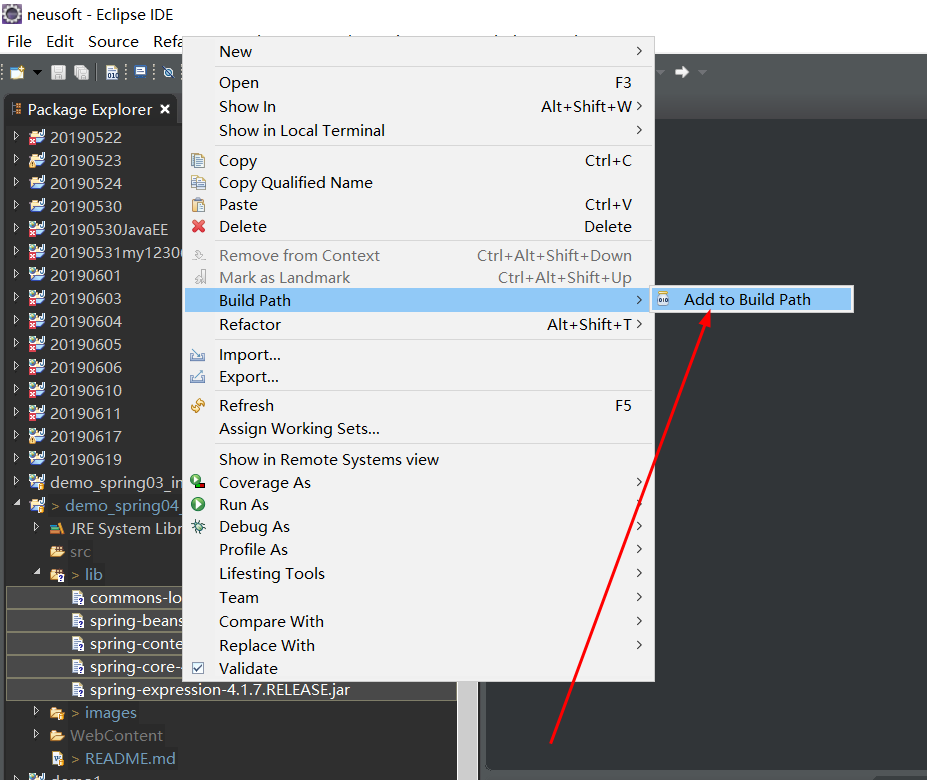
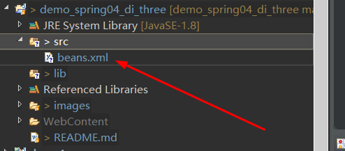

# Java-Spring依赖属性的构造函数注入

1. 新建一个Java Project


2. Java工程导jar包

+ 创建一个lib文件夹


**如图所示新建完成**


+ 导入jar包



+ 新建或导入配置文件

**beans.xml**
```
<?xml version="1.0" encoding="UTF-8"?>

<beans xmlns="http://www.springframework.org/schema/beans"
       xmlns:xsi="http://www.w3.org/2001/XMLSchema-instance" xmlns:tx="http://www.springframework.org/schema/tx"
       xmlns:context="http://www.springframework.org/schema/context"
       xsi:schemaLocation="http://www.springframework.org/schema/beans 
       http://www.springframework.org/schema/beans/spring-beans.xsd 
       http://www.springframework.org/schema/tx 
       http://www.springframework.org/schema/tx/spring-tx.xsd 
       http://www.springframework.org/schema/context 
       http://www.springframework.org/schema/context/spring-context.xsd">
</beans>
```
3. 新建test/MyController  test/MyService test/MyDao

