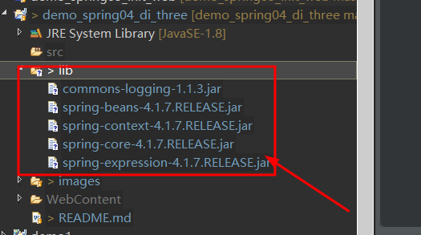

# Java-Spring依赖属性的构造函数注入

1. 新建一个Java Project


2. Java工程导jar包

+ 创建一个lib文件夹


**如图所示新建完成**


+ 导入jar包



+ 新建或导入配置文件

**beans.xml**
```
<?xml version="1.0" encoding="UTF-8"?>

<beans xmlns="http://www.springframework.org/schema/beans"
       xmlns:xsi="http://www.w3.org/2001/XMLSchema-instance" xmlns:tx="http://www.springframework.org/schema/tx"
       xmlns:context="http://www.springframework.org/schema/context"
       xsi:schemaLocation="http://www.springframework.org/schema/beans 
       http://www.springframework.org/schema/beans/spring-beans.xsd 
       http://www.springframework.org/schema/tx 
       http://www.springframework.org/schema/tx/spring-tx.xsd 
       http://www.springframework.org/schema/context 
       http://www.springframework.org/schema/context/spring-context.xsd">
</beans>
```
3. 新建test/MyController  test/MyService test/MyDao


**MyController**
```
package test;

public class MyController {

	private MyService service;
	
	public MyController(MyService myService)
	{
		this.service = myService;
	}
	public void login() 
	{
		System.out.println("MyController login........");
		service.serviceLogin();
	}
}
```
**MyService**
```
package test;

public class MyService {

	private MyDao dao;//MyService依赖MyDao
	/**
	 * 为咯给属性赋值 就在属性所在的
	 * 类里面设置一个构造方法
	 * 并且该构造方法接收一个该属性类开的参数
	 * <p>Title: </p>  
	 * <p>Description: </p>  
	 * @param myDao
	 */
	public MyService(MyDao myDao)
	{
		this.dao = myDao;
	}
	public void serviceLogin() {
		System.out.println("MyService serviceLogin()......");
		dao.queryUserByNameAndPwd();
	}
}
```
**MyDao**
```
package test;

public class MyDao {

	public void queryUserByNameAndPwd() 
	{
		System.out.println("MyDao queryUserByNameAndPwd");
	}
}
```
4. 构造函数配置（亮点加重点）
